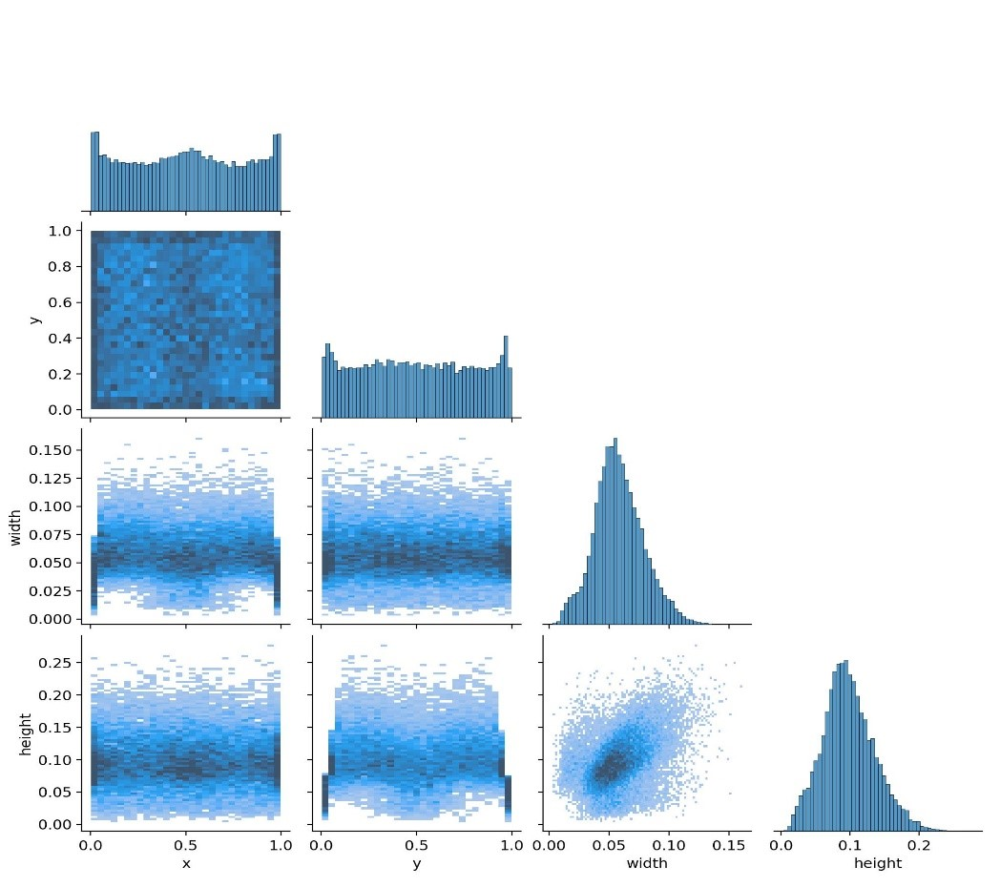
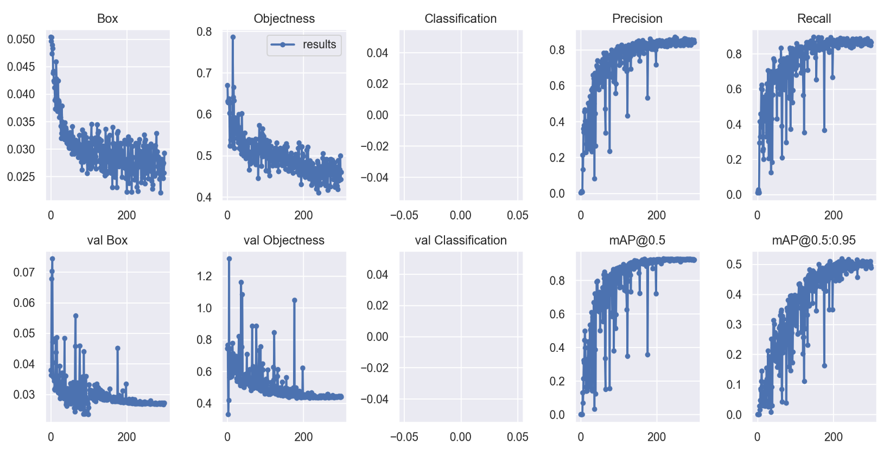

# ICCKE2022-Challenge
This repository relates to ICCKE 2022 AI FUM Challenge's solution about poultry abnormality detection.

# Overview
The aim of the challenge is to detect abnormal behaviors (presence of disease) among chickens on a broiler farm.

In broiler farms, birds are kept free (without cages) in a shed.
The challenge is the detection and tracking of chickens individually and the detection of abnormal behavior (such as the presence of disease in chickens) using the processing of images obtained from surveillance cameras.

# Problem
Various parameters could indicate the abnormal behavior or disease in poultry.

The two main parameters which should be calculated are the mobility of each chicken and how they are dispersed on the farm floor.
It should be noted that the mobility of sick chickens decreases.Also, the poultry should be dispersed homogeneously on the level of the chicken farm. 
Non-homogeneous dispersion of chickens in representative poultry farms indicates a problem, such as the non-uniformity of the ambient temperature on the farm.

### The demands of the problem:

>1. Detection of chickens and separation of chickens (each segment should contain one chicken)
>
> 2.  Counting the chickens (number one from the top left and the last number from the bottom right)
>
> 3.  Tracking the detected chickens from the previous steps
>
> 4. Calculation of the movement of each chicken over time
>
> 5.  Detection of abnormality in the placement of chickens on the floor of the hall
>
> 6.  Defining a new parameter for diagnosing sick chickens
>
> 7.  Develop ideas for improving and increasing the coverage of the image processing system for the current field

### Additional notes:

>1. The calculation must be real-time and the processing speed must be at least three frames per second. The hardware is a laptop GPU (such as ti 1060) or a central processor with eight real cores and 16 threads or in combination. The minimal use of hardware is considered a positive point.
>
>2. The lighting conditions are stable to a large extent; the images are either during the day or at night (the cameras are night vision) – that is, different scenarios can be adopted for the two modes of night and day.
>
>3. The programming language must be Python and be modular as much as possible for different evaluations.
>
>4. In some articles, methods such as examining the chicken’s skeleton and processes based on deep learning have been used to diagnose diseases in chickens. These articles in the references section will be given a separate positive score to get to know the generality of the introduced problem, the use of innovative methods, or the existing methods.
>
>5. Providing explanations in a PDF file is mandatory. The quality of the submitted file also includes points.
>
>6. In the problem requirements section, the code should be implemented in such a way that it is possible to test each of the 1025 steps with a limited number of frames or single frames.
>
>7. For ease and improvement of accuracy, full-page processing of one frame is not required. 76% of the middle of the image from the width – 84% of the middle of the image from the height is the ROI (region of interest) of the problem.
>
>8. The corresponding dataset is unlabeled by default, but there is no limit for labeling. Also, there is no limit to the proposed method, whether based on deep learning or classical image processing methods.

# Solution

>### **_Table of contents_**:
>*  ### [Introduction](#1)
>*  ### [Information of solution](#2)
>*  ### [Code and Test on custom data](#3)
>*  ### [Conclution and Future works](#4)

<h2 id="1">Introduction</h3>
Nowadays, the intelligence of various systems has a major impact on increasing production in various aspects of human life.

Not only Broiler farms are one of the basic pillars of food production for humans but also the number of broiler chickens in the world is equal to the human population on earth.

Mechanization of processes in poultry farms can prevent epidemics and culling of other populations by early disease detection.
In this report, the solution is described, and gather the results obtained.

In the first part, we will describe the details of the proposed solution.
In the second part, the structure of the implemented program and also the codes are described in detail.
Finally, Conclusions and suggestions will be discussed in the final section.

<h2 id="2">Information of solution</h3>
At present, deep artificial neural networks are used in image processing systems to extract features.
These networks can quickly learn the features needed for different tasks and are highly accurate in detecting categories.

Our proposed solution consists of three different parts that are placed together as a pipeline. 
The first part is the detection of chickens in images. In this part, every object or chickens in each image must be identified with high accuracy.
The next part is tracking objects in movies. In this part, using new algorithms and methods will be used to follow each chicken in different images that come one after the other.
The use of features extracted by pre-trained networks in this part has led to high accuracy in tracking and detecting chickens.
In the third part, the analysis of the movements of objects in the environment is discussed to determine the abnormal states. 
By using the movements of all objects and the methods of machine learning and time series processing, it is attempted to detect the abnormal states.

### Detection and Counting
Deep artificial neural networks are used to find objects in CCTV images.
These networks require labeled datasets for training. In this section, we first prepare the dataset needed to train these networks, and then we train deep networks with different architectures and compare the accuracy and speed of each. 

To train artificial neural networks with the aim of finding the location of objects in images, a set of data is needed where the location of objects in images is known for each image.
To prepare this set of images, 500 frames from different videos were used and these frames were divided into three categories for training, testing and evaluation.
Here, 75% of the data was used for training, 20% for testing, and 5% for evaluation.

Three people labeled the images simultaneously, and all labels were checked by two other people to ensure the accuracy of the labeled data.
In the prepared dataset, the label is a list of points that are considered for each object, where its starting location (top left) and the length and width of this point are given.

<figure class="image">
  
    
  <figcaption>(before and after labeling of a frame from the prepared dataset)</figcaption>
</figure>

### YOLO
YOLO stands for "You Only Look Once".

In fact, this phrase refers to the ability of the human visual system to detection objects with a glance.
Therefore, the YOLO object detectom system is designed with the aim of providing a method similar to the functioning of the human vision system. 

YOLO looks at object detection as a regression problem that goes directly from image pixels to box coordinates and class probabilities, YOLO is the fastest among existing networks for object detection because each image is only looked at once, which makes it suitable for real-time application.

### YOLO-v5 vs YOLO-v7
In this part, we present the results of our object detection project using YOLO-v5 and YOLO-v7 neural networks. 

we aimed to evaluate the performance of two object detection neural networks, YOLO-v5 and YOLO-v7, on a custom dataset. 
Both networks were trained using a fine-tuning technique and different image sizes to assess their accuracy and speed of detection.

### YOLO-v5
The YOLO-v5 network was trained on the prepared dataset with 640x640 image size and during 150 epochs. 
The results obtained are presented in the following figure:

<figure class="image">
    
    
    
    
    
    
    
</figure>

### YOLO-v7
The YOLO-v7 network was trained on the prepared dataset with 640x640 image size and during 300 epochs. 
The results obtained are presented in the following figure:

<figure class="image">
    
    
    
    
    
    
    
</figure>

As a comparison between YOLO-v5 and YOLO-v7, it was found that YOLO-v7 not only had better accuracy, but was also faster in detection. 
Therefore, YOLO-v7 was selected for continued use in the project.

The final accuracy of detection and poultry segmentation for YOLO-v5 and YOLO-v7 were reported as 0.8764 and 0.9215 respectively.

To increase the accuracy of these models and reduce the training time, transfer learning was utilized by incorporating large pre-existing datasets and fine-tuning with a limited number of epochs using the data collected.
These models have a significant number of hyperparameters, each of which plays a crucial role in determining the outcome.

To improve the precision of the trained model, an evolutionary algorithm was used to optimize the hyperparameters.
This was achieved through 90 training sessions to determine the optimal hyperparameters.

The following image showcases 20 superior models generated through the evolutionary learning algorithm, with all of the top models available in the Evolve.csv file:

<figure class="image">
    
</figure>
The accompanying image showcases the optimal values of hyperparameters that result in improved accuracy:

<figure class="image">
    
</figure>

### Tracking
Tracking objects in video is a crucial task in computer vision,  which involves the identification of specific objects in consecutive frames of a video.
This task is typically accomplished by using algorithms like Deep Sort, along with a feature extraction model (Featurizer) to compare the similarity of objects in consecutive frames.

However, a challenge of this approach is the need for fine-tuning the Featurizer network on the specific problem data, which requires the availability of training data and their corresponding labels.
To overcome this challenge, we propose a novel approach to object tracking that utilizes the OpenAI CLIP model.

The CLIP model is a state-of-the-art deep learning model trained on a large dataset and capable of extracting semantic features from images without additional fine-tuning.
So by using the CLIP model as the Featurizer network in our tracking algorithm, we are able to achieve Zero Shot Object Tracking.
This eliminates the need to fine-tune the Featurizer network on the problem data, and allows us to perform object tracking without relying on previously trained detection models.

In summary, by leveraging the power of the CLIP model, our approach enables object tracking with using the weight of previous training models on the detection step.

### Abnomality Detection
In this part of the proposed solution, the objects detected in the previous section are tracked and their movements are analyzed to identify any abnormal states.

For the analysis of the movements of objects in the environment, the movements of all objects have been considered, and machine learning and time series processing methods have been used to detect abnormal states.

<-TODO>

<h2 id="3">Code and Test on custom data</h3>
In order to evaluate the implemented structure or test on your custom data, you must need to change directory by executing the following command in the terminal:

> cd .\ICCKE2022\

Prior to proceeding, ensure to specify the --conf flag for confidence level and the --source flag for the location of your custom data as you want.

In order to detection chickens on custom data
> python detect.py --weights train/chicken-640/weights/best.pt --conf 0.4 --source test.jpg

In order to counting chickens on custom data
> python detect.py --weights train/chicken-640/weights/best.pt --count --conf 0.4 --source test.jpg

In order to tracking chickens on custom data
> python zero-shot-tracking\clip_object_tracker.py --weights train/chicken-640/weights/best.pt --conf 0.4 --source test.mp4 --detection-engine yolov7 --info

In order to detection abnormal states on custom data
> python detect.py --weights train/abnormal-640/weights/best.pt --conf 0.55 --source test.jpg

<h2 id="4">Conclution and Future works</h3>
In conclusion, the proposed solution for the detection, tracking, and analysis of chickens in poultry farms has been successful in achieving its goal.

By using deep artificial neural networks and other methods, high accuracy has been achieved in detecting and tracking chickens in images.
There is still room for improvement in the proposed solution.

In the future, it is possible to improve the accuracy and speed of the system by using more advanced machine learning algorithms and techniques.
Additionally, the system can be expanded to include more advanced analysis methods to detect other abnormal states in poultry farms.

Overall, the proposed solution has the potential to greatly improve the management and efficiency of poultry farms by preventing epidemics and reducing the number of culled chickens.

## References

- [Project Overview (roboflow.com)](https://universe.roboflow.com/fum-icce/chicken-detection-z6wni)
- [ultralytics/yolov5: YOLOv5 🚀 in PYTorch > ONNX > CoreML > TFLite(github.com)](https://github.com/ultralytics/yolov5)
- [VI WongKinYiu/yolov7: Implementation of paper - YOLOv7: Trainable bag-of-freebies sets new state-of-the-art for real-time object detectors (github.com)](https://github.com/WongKinYiu/yolov7)
- [MShirshekar/zero-shot-object-tracking: Object tracking implemented with the Roboflow Inference API, DeepSort, and OpenAl CLIP. (github.com)](https://github.com/MShirshekar/zero-shot-object-tracking)
- [AI-FUM-Challenge](https://iccke.um.ac.ir/2022/Home/NewsContent?id=4018)
